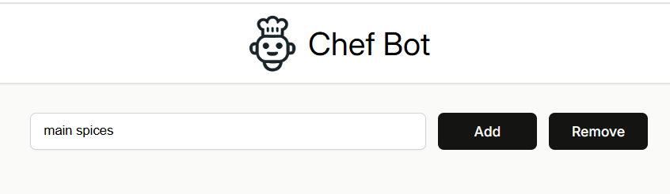
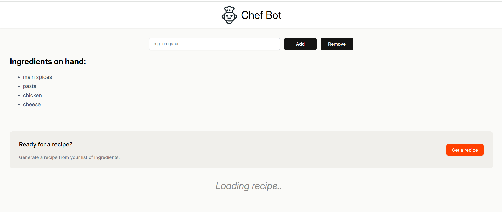
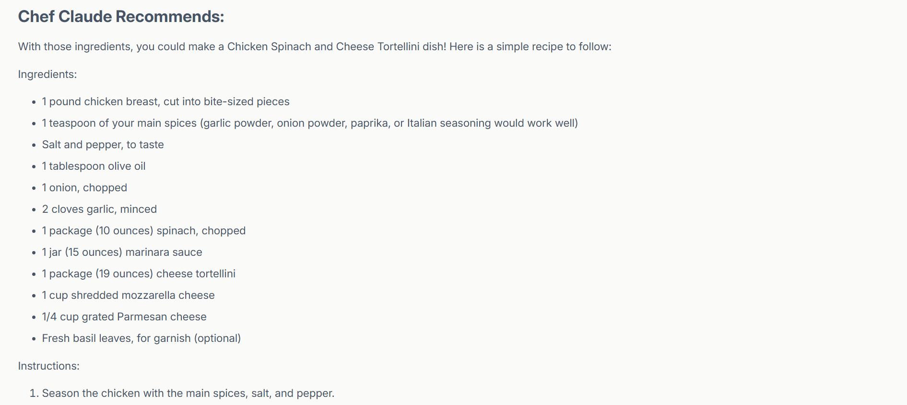

<h1>
  
  Chef Bot
</h1>

## An AI recipe generator app that takes in ingredients and makes a recipe

The user is able to add ingredients by using the text box and also remove them. Once at least 4 ingredients are added, the Hugging Face AI is able to generate a recipe from those ingredients

The app was built with the help of Scrimba's React course.
However, i have added extra features such as:
- "Remove ingredients" button
- A loading animation
- A backend to hide the API key safely

## Demo

- When the app first loads, there will be a textbox, where the user can type in any ingredient
- There is also two buttons, one to add an ingredient and another to remove.

- Once the user inputs at least 4 ingredients, a recipe container appears, which tells the user that they can generate a recipe now.
- Once the button is pressed, a loading animation plays as the API develops a response

When the response is rendered, the loading text disappears and the markdown is formatted to be easily readable

## From this project, I've learnt about...

State:
- Event listeners
- Using `useState`
- Updating state using a callback function
- Conditional rendering using ternary and `&&`
- Toggling state
- Arrays as a state
- Objects as a state

Forms in React:
- event.preventDefault()
- event.currentTarget()
- FormData()
- Form action in react

State & Props:
- More conditional rendering practice
- Passing state as props
- Setting state from child components
- Shared state
- Managing where state should be held

Backend:
- .env
- express
- dotenv
- axios
- cors
- POST request
- JSON

Using asynchronous programming with API